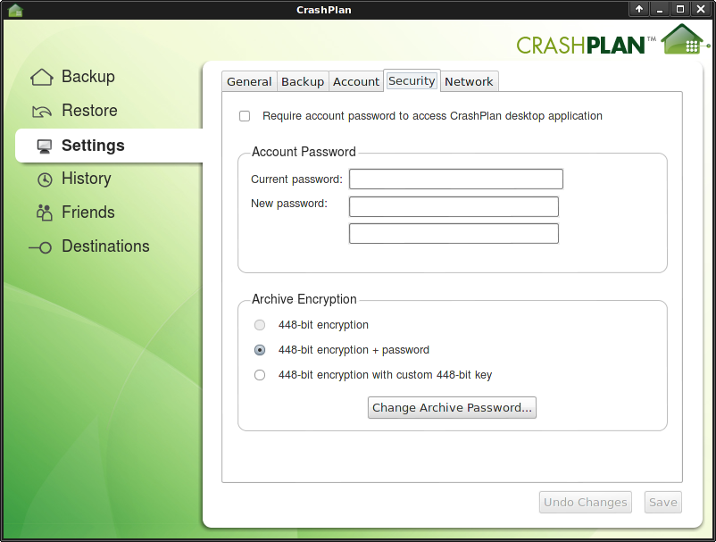
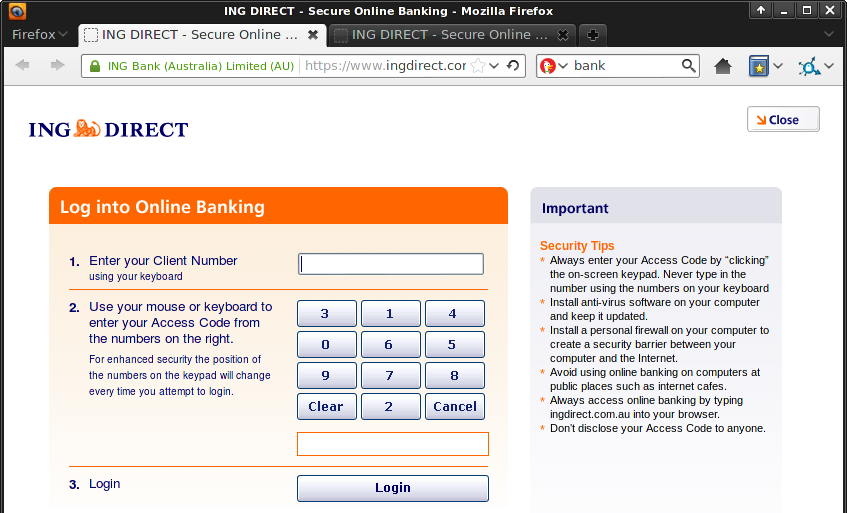
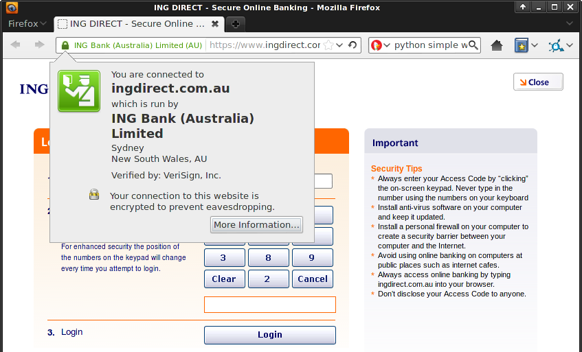

Computer security for the lazy
==============================
This is a guide for the *lazy*. If you are living under a tyrannical government (like Syria or Iran), or if you are a whistleblower, activist, or a journalist wanting to protect your sources, you can't afford to be lazy.

For the rest of us lazy bastards, here's the shit you need to worry about (in order of importance):

* losing your files
* losing your accounts
* losing your privacy

Losing your files
-----------------
All your photos of family and friends. All your financial records. All your university homework. All that porn you've been stashing. The biggest computer security threat you'll ever have to worry about is losing them. Every hard drive is a ticking time bomb, just waiting to fail. You could accidentally leave your laptop in the back of a taxi and never see it again. Recently there has been a spate of attacks where criminals will gain remote access to your computer, encrypt everything on it, and then demand ransom payment to decrypt it. However it happens the results are the same - you've lost your shit.

Thankfully preventing these problems is easy; I'll show you how to *back your shit up*.

Losing your accounts
--------------------
Your email. Your internet banking. Your Facebook, Twitter and World of Warcraft character. These are all "accounts" and you can lose them. If you choose a shitty password someone can just guess or "brute force" it. If you're tricked into installing malicious software it can log every keystroke you press, recording your passwords. If you are directed to a spoofed version of a trusted website and you try to log in, you've just given the bad guys your password. If you use the same password everywhere you're truly fucked.

Unfortunately there isn't a single easy solution to these threats. The best thing is having a well calibrated "bullshit" detector. Using a password manager and keeping your computer up to date with security patches will also help. *Don't get hacked*, keep reading and I'll show you how.

Losing your privacy
-------------------
Take any private photos of you and your partner? Do you write a pseudonymous blog like "[Belle de Jour](https://en.wikipedia.org/wiki/Belle_de_Jour_%28writer%29)" or at the other end of the sexual activity spectrum, "[Nice Jewish Girl](http://www.shomernegiah.blogspot.com/)"? Don't want someone going through the soppy love poems emailed to your partner? Want to complain about work to a friend over chat / IM without getting fired?

Remember that laptop you left in the back of a taxi? Someone could go through all the files on it. Browsing on an insecure wifi network could give you away to anyone within range. Depending on which country you live in, your ISP could be obliged to log your browsing history, where criminals will undoubtedly hack in and get access to it at some point.

The threat to privacy is a bit more esoteric than losing your files or accounts, because it isn't obvious when it happens. When you lose your hard drive, you know about it. When someone steals money out of your bank account, you know about it. When Facebook gathers information about the websites you visit and sells it to other companies, you're left in the dark.

To stop this, I'm going to teach you how to *keep that shit private*.

Back your shit up
=================
Threats to your files (in order of likelihood):

* hard drive failure
* losing your laptop
* malicious attacks

You can prevent all of them by keeping proper backups. It's pretty simple:

* Use automated backup software
* Keep a copy at different places, in case your house burns down
* Encrypt your backups so other people can't pry into them

Most of this is taken care of if you use decent backup software like [Crashplan](http://www.crashplan.com/). It keeps incremental backups of your files as you work. It updates itself automatically. You can backup to external hard drives. You can backup to Crashplan's servers "in the cloud" for $$$. You can backup to your friends computers over the net for free (as long as they run Crashplan). Your backups are encrypted so that only you can open them up and see the files. It's available for Linux, Mac and Windows and it's dead easy to setup. In a word it is brilliant, stop reading this and start downloading it.

I'm not going to write an in depth guide to get it up and running, I'll let Crashplan's tech support help you with that. The only thing I will add is that you should definitely secure your Crashplan encryption key with a private password, not just leave it at the default settings. With the default settings the friendly staff at Crashplan HQ could have a lot of fun digging through your backups to see those naked photos you took of yourself.

Here's how to secure your backups with a private password:

1. Open Crashplan's desktop application
2. Go to **Settings**
3. Go to the **Security** tab
4. Under archive encryption, select **448-bit (or 128-bit) encryption + password**
5. Enter a *different* password, make it long - 20 characters or more
6. Do not forget this password

If you forget the password you won't be able to restore backups, defeating the whole point. Read the *Don't get hacked* section for help with managing your passwords.

When you are done, perform a backup, and then make sure it has worked by pretending that your hard drive has died. Restore some of the files and check that they are ok. You don't want the first test of your backup system to be when you *really* need it, because if it doesn't work then, you're fucked.

Don't get hacked
================

Threats to your accounts:

* poor password habits
* Falling for a con
* security vulnerabilities is software

Poor password habits
--------------------

Passwords are keys. Keys are useful, but their effectiveness depends heavily on how you use them. Having a short password is the digital equivalent of keeping the key underneath the doormat. Unlike keys, with passwords the criminals don't run the risk of being caught lifting the TV into their van and subsequently arrested. Instead they can break and enter all day from the comfort and safety of their keyboards. Don't leave it under the mat, use long passwords, 20 characters or more.

You probably have a key for your front door, a key for your car, a key for work etc. If you used the same key for everything, your workmates would be able to steal your car. I'm torturing this metaphor to breaking point, but that is the risk you run online if you use the same password everywhere. Read IT security news and every week you'll hear about the latest high profile website to have been compromised, with users' data (including passwords) being leaked. If you use the same password everywhere, criminals gain access to all your accounts, not just the one.

Change your passwords frequently too, if a criminal gets access to one, you might not know about it. They could just be waiting for your bank balance to increase before it's worth draining.

### Use a password manager
You probably don't keep your keys jangling around loosely in the bottom of your bag. You have a *keyring*. Enter the password manager. All your passwords can be stored in a password manager, different ones for every account, all 20 characters or longer and you don't even have to remember them. It's still secure because the keyring itself is locked up in a box. Only you have the one "master password" to open the box and fish out the other ones as needed. Every password manager will include a password generator, so you don't even have to think up the passwords for all your accounts, they can be randomly generated for you.

The password manager I recommend is [KeePass](http://keepass.info/download.html). Just make sure to download the 'Classic' edition and not the 'Professional' edition which is needlessly bloated with dotnet/mono. On windows this means use 'KeePass 1', on Linux/Mac use 'KeePassX'. Downloading, installing and using KeePass is fairly straightforward so I won't spell it out for you.

**Extremely important - make your "master password" long**. The master password is a single point of failure, meaning that if someone else gets it, they get *all* your passwords. Don't use '12345'. Pick a sentence or a sequence of words, for example 'elevator principle mirth condiment existential vommit'. If your imagination fails you, pick random words [using dice and a dictionary](http://world.std.com/~reinhold/diceware.html).

If you frequently use different computers or devices, put your password database on a USB stick or upload it to some 'cloud storage' like dropbox. There's a portable version of KeePass that runs off of a USB stick, and versions for iOS, Android, and everything under the sun. If someone else gets their hands on your password database it doesn't matter, as long as you keep the master password safe.

Falling for a con
-----------------

"Social engineering" is the computer security term for con artists plying their trade. They have a bag of tricks to throw at you in the hope that you'll hand over access to your online accounts or your computer. I'll go over some of the most common scams.

### Fake tech support phone calls
You get a call on the telephone and they tell you there's a problem with your computer. They pretend to be helpful tech support people so you follow their instructions and wham, you've just given them remote access to your computer where they can do whatever they want. This includes installing keystroke loggers so they can record everything you type, including all your passwords.

Avoiding this one is easy, just hang up the phone. Or for bonus points, string them along to waste their time. If you get a call you really think is genuine, for example from your employers tech support, hang up anyway, and then *you* call *them* on a number you already know and trust.

### Spoofed websites and emails.
You get an email that looks like it came from your bank/paypal/etc. Inside the email is a link to the bank/paypal/etc website. It is a instead a counterfit email that doesn't link to the real website, but to a spoofed website that looks exactly the same. You enter your username and password, thereby handing it over to the con artists.

First up, use an email provider with a decent spam filter and most likely you'll never even see these messages in the first place. Apart from that the easiest way to avoid this scam is to never click on links in emails, no matter how genuine they look. If you need to go to your bank/paypal/etc website, open up a browser and type in the address manually. Don't follow those links. You can also spot spoofed emails by their lack of anything that directly relates to you or your account, they will only have generic information that applies to everybody. You will probably get spoof email from paypal even if you don't have a paypal account - because the scammers don't know that.

Email is one of the older ways to con you in to visiting a spoofed website, now there's facebook, twitter, you name it. Most people trust their "friends" and will click on the links that they post. But if your "friend's" account has been compromised, the spammers can post anything they like, including links to spoofed websites. So you need to know how to spot them. There are some fake website detectors built in to most browsers which can automatically protect you. They all rely on keeping a blacklist of known fakes though, so if a new one pops up there can be a delay before it gets added to the list. You still have to keep an eye out.

Identifying a spoofed website requires a tiny bit of your attention. Trusted authorities give out "certificates" to verify that websites are who they say they are, and not someone else faking it. The easiest way to detect a spoof is the absence of any such certificate. Let's open Firefox and play spot the difference:

This is ING's internet banking site. Just kidding! It's actually spoof of their site that I made. All I had to do was download the page, chuck it on a simple local webserver, and edit my hosts file to make my computer think www.ingdirect.com.au is my own machine. Took 5 minutes. Here is the real site:

Spot the difference? Look in the address bar - where the spoof site shows a globe, the real site shows a padlock. This indicates that the real website is using https, not plain http. The "s" stands for "secure". The bank's real site also supplies identity information, which you can see by clicking on the padlock or globe icon. let's take a look:

The pictures say it all really.

Security vulnerabilities is software
------------------------------------

TODO

Keep that shit private
======================

TODO

About this document
===================
This document is licensed under a Creative Commons Attribution-ShareAlike 3.0 Unported License.

Last changed October 2012

Authors:

* [Daniel Kinsman](https://danielkinsman.wordpress.com/)