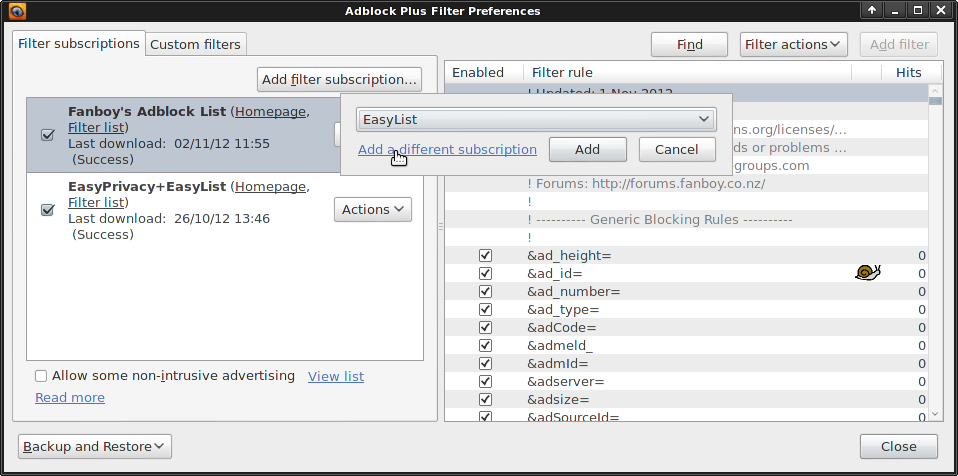
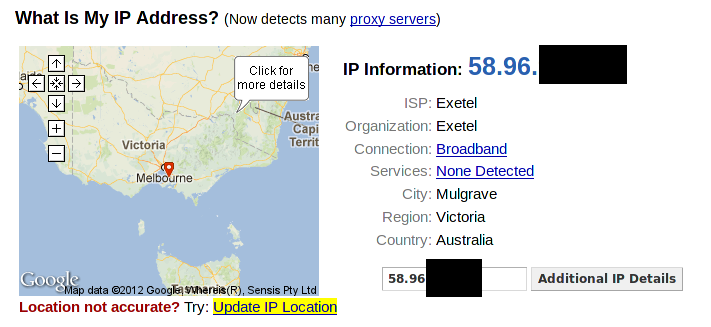
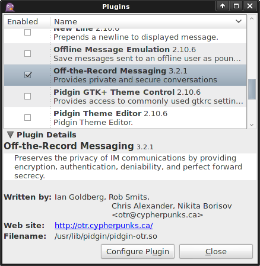

Computer security for the lazy
==============================
This is a draft still being written, so you might want to wait until it's completed and reviewed by a third party to make sure I'm not giving any bad advice. It's a guide for the *lazy*. If you are living under an oppressive government (like Syria or Iran), or if you are a whistleblower, activist, or a journalist wanting to protect your sources, you can't afford to be slack.

For the rest of us lazy bastards, here's the shit you need to worry about (in order of importance):

* losing your files
* losing your accounts
* losing your privacy

Losing your files
-----------------
All your photos of family and friends. All your financial records. All your university homework. All that porn you've been stashing. The biggest computer security threat you'll ever have to worry about is losing them. Every hard drive is a ticking time bomb, just waiting to fail. You could accidentally leave your laptop in the back of a taxi and never see it again. Recently there has been a spate of attacks where criminals will gain remote access to your computer, encrypt everything on it, and then demand ransom payment to decrypt it. However it happens the results are the same - you've lost your shit.

Thankfully preventing these problems is easy; I'll show you how to *back your shit up*.

Losing your accounts
--------------------
Your email. Your internet banking. Your Facebook, Twitter and World of Warcraft character. These are all "accounts" and you can lose them. If you choose a shitty password someone can just guess or "brute force" it. If you're tricked into installing malicious software it can log every keystroke you press, recording your passwords. If you are directed to a spoofed version of a trusted website and you try to log in, you've just given the bad guys your password. If you use the same password everywhere you're truly fucked.

Unfortunately there isn't a single easy solution to these threats. Having a well calibrated "bullshit" detector is essential. Using a password manager and keeping your computer up to date with security patches will also help. *Don't get hacked*, keep reading and I'll show you how.

Losing your privacy
-------------------
Take any private photos of you and your partner? Do you write a pseudonymous blog like "[Belle de Jour](https://en.wikipedia.org/wiki/Belle_de_Jour_%28writer%29)" or at the other end of the sexual activity spectrum, "[Nice Jewish Girl](http://www.shomernegiah.blogspot.com/)"? Don't want someone going through the soppy love poems emailed to your partner? Want to complain about work to a friend over chat / IM without getting fired?

Remember that laptop you left in the back of a taxi? Someone could go through all the files on it. Browsing on an insecure wifi network could give you away to anyone within range. Depending on which country you live in, your ISP could be obliged to log your browsing history, where criminals will undoubtedly hack in and get access to it at some point.

The threat to privacy is a bit more esoteric than losing your files or accounts, because it isn't obvious when it happens. When you lose your hard drive, you know about it. When someone steals money out of your bank account, you know about it. When Facebook gathers information about the websites you visit and sells it to other companies, you're left in the dark.

To stop this, I'm going to teach you how to *keep that shit private*.

Back your shit up
=================
Threats to your files (in order of likelihood):

* hard drive failure
* losing your laptop / phone
* malicious attacks

You can prevent all of them by keeping proper backups. It's pretty simple:

* Use automated backup software
* Keep a copy in different places, in case your house burns down
* Encrypt your backups so other people can't pry into them

Most of this is taken care of if you use decent backup software. **Unfortunately I can no longer recommend Crashplan.** It's not their fault, but recently the [FBI has been pushing for mandatory backdoors in commercial software](https://www.schneier.com/blog/archives/2013/06/the_problems_wi_3.html). As a consequence I can only recommend using open source software, I'll have to do some digging and report back when I've found a good alternative (sorry [Stallman](https://en.wikipedia.org/wiki/Richard_Stallman), I should have listened to you).

I haven't found a solution I'm overly fond of for automatically backing up smartphones / tablets. These devices are mostly used for browsing content, not producing it, so there's less important stuff to lose. The few exceptions are contact information and photos taken with the built in camera. I copy these to my computer periodically, where they are backed up by my regular backup software.

When you are done setting up your backup software, perform a backup, and then make sure it has worked by pretending that your hard drive has died. Restore some of the files and check that they are ok. You don't want the first test of your backup system to be when you *really* need it, because if it doesn't work then, you're fucked.

Don't get hacked
================

Threats to your accounts:

* poor password habits
* falling for a con
* security vulnerabilities in software

Poor password habits
--------------------

Passwords are keys. Very useful, but their effectiveness depends heavily on how you use them. A short password is the equivalent of keeping the key underneath the doormat. Unlike keys, with passwords the criminals don't run the risk of being caught lifting the TV into their van and subsequently arrested. Instead they can break and enter all day from the comfort and safety of their keyboards. Don't leave it under the mat, use long passwords, 20 characters or more.

You probably have a key for your front door, a key for your car, a key for work etc. If you used the same key for everything, your workmates would be able to steal your car. I'm torturing this metaphor to breaking point, but that is the risk you run if you use the same password everywhere. Read IT security news and every week you'll hear about the latest high profile website to have been compromised, with users' data (including passwords) being leaked. If you use the same password everywhere, when one account is compromised, the bad guys gain access to *all* of your other accounts too.

Change your passwords frequently too, if a bad guy gets access to one, you might not know about it straight away. They could just be waiting for your bank balance to increase before it's worth draining.

### Use a password manager
You probably don't keep your keys jangling around individually in the bottom of your bag. They are most likely all together on a *keyring*. Enter the password manager. All your passwords can be stored in a password manager, different ones for every account, all 20 characters or longer and you don't even have to remember them. It's still secure because the keyring itself is locked up inside a box. Only you have the one "master password" to open the box and fish out the other keys as needed. As a bonus, every password manager will include a password *generator*, so you don't even have to think up new passwords, they can be randomly generated for you.

The password manager I recommend is [KeePassX](https://www.keepassx.org/). Downloading, installing and using KeePassX is fairly straightforward so I won't spell it out for you.

**Extremely important - make your "master password" long**. The master password is a single point of failure, meaning that if someone else gets it, they get *all* your passwords. Don't use '12345'. Pick a sentence or a sequence of words, for example 'elevator principle mirth condiment existential vomit'. If your imagination fails you, pick random words [using dice and a dictionary](http://world.std.com/~reinhold/diceware.html).

If you frequently use different computers or devices, put your password database on a USB stick or upload it to some 'cloud storage' like DropBox. KeePassX will run off of a USB stick, and there are versions for iOS, Android, and everything under the sun. If someone else gets their hands on your password database it doesn't matter, as long as you keep the master password safe.

Falling for a con
-----------------

"Social engineering" is the computer security term for con artists plying their trade. They have a bag of tricks to throw at you in the hope that you'll hand over access to your online accounts or your computer. I'll go over some of the most common scams.

### Fake tech support phone calls
Someone calls you on the telephone and tells you that there's a problem with your computer. They pretend to be helpful tech support people so you follow their instructions and wham, you've just given them remote access to your computer where they can do whatever they want. This includes installing keystroke loggers so they can record everything you type, including all your passwords.

Avoiding this one is easy, just hang up the phone. Or for bonus points, string them along to waste their time. If you get a call you think is actually genuine, for example from your employer's tech support, hang up anyway, and then *you* call *them* on a number you already know and trust.

### Spoofed websites and emails.
You get an email that looks like it came from your bank/paypal/etc. Inside the email is a link that appears to point to the website of the bank/paypal/etc. But it's really a counterfeit email that links to a spoofed website which mimics the real one. You enter your username and password, thereby handing it over to the con artists.

If you use an email provider with a decent spam filter, most likely you'll never even see these messages in the first place. Apart from that the easiest way to avoid this scam is to never click on links in emails, no matter how genuine they look. If you need to go to your bank/paypal/etc website, open up a browser and type in the address manually. Don't follow those links. You can also spot spoofed emails by their lack of anything that directly relates to you or your account, they will only have generic information that applies to everybody. You will probably get spoof email from paypal even if you don't have a paypal account - because the scammers don't know that.

Email is one of the older ways to con you in to visiting a spoofed website, now there's facebook, twitter, you name it. Most people trust their "friends" and will click on the links that they post. But if your "friend's" account has been compromised, the spammers can post anything they like, including links to spoofed websites. So you need to know how to spot them. There are some fake website detectors built in to most browsers which can automatically protect you. They all rely on keeping a blacklist of known fakes though, so if a new one pops up there can be a delay before it gets added to the list. You still have to keep an eye out.

Identifying a spoofed website requires a tiny bit of your attention. Trusted authorities give out "certificates" to verify that websites are who they say they are, and not someone else faking it. The easiest way to detect a spoof is the absence of any such certificate. Let's open Firefox and play spot the difference:

This is ING's internet banking site. Just kidding! It's actually spoof of their site that I made. All I had to do was download the page, chuck it on a simple local webserver, and edit my hosts file to make my computer think www.ingdirect.com.au is my own machine. Took 5 minutes. Here is the real site:

Spot the difference? Look in the address bar - where the spoof site shows a globe, the real site shows a padlock. This indicates that the real website is using https, not plain http. The "s" stands for "secure". The bank's real site also supplies identity information, which you can see by clicking on the padlock or globe icon. let's take a look:

Notice that the spoof "does not supply identity information" whereas the real site's certificate tells me what their web address is and who they are. It also mentions encryption, which we'll talk about later in the *Keep that shit private* chapter. Other browsers, including mobile browsers for iOS and Android, should have similar "padlock" features, though you might have to hunt for them. [Firefox mobile](https://www.mozilla.org/mobile/) for Android works particularly well.

### Spearphishing
After a while you might get used to the spotting the regular spams and cons. It's easy to tell them apart by their genericness. Spearphishing is different - it is directly targeted at you. The scammer will do their research first, by searching for you online and reading all the public information they can find - reading your blog, twitter, public facebook posts etc. Then they will craft an email just for you - in my case it might be "I read your security for the lazy guide, can you help me out with a question?" Inside the email somewhere will be a link to a malicious website, or an attachment with a trojan. Always be wary of unsolicited email.

Security vulnerabilities in software
------------------------------------

Software always has bugs. Bad people learn of these bugs, then exploit them to install keyloggers, backdoors or whatever they like on your machine. Most often the exploits will need some interaction on your part to work, so con artists will use social engineering tricks to deliver them. A [recent example](https://twitter.com/meta_lab/status/258450874735677440) is a spreadsheet titled "List of Tibet political self-immolations.xls" doing the rounds, promising that "Rare footage shows extreme measures of Tibetan protesters". If you download and open the spreadsheet, it will use security vulnerabilities in Microsoft Windows and Excel to install bad stuff.

Exploits can also affect your router / modem, which  once compromised, can spy on all your browsing, and redirect your traffic to spoofed websites. Recently [4.5 million DSL models in Brazil were compromised](http://arstechnica.com/security/2012/10/dsl-modem-hack-infects-millions-with-malware/), with many internet banking accounts lost.

Some rare and nasty security bugs don't need any action on your part to compromise your computer - just being on the network is enough. The best way to avoid being affected by these vulnerabilities is to keep your software up to date. Upgrade your browser. Download those security patches for your operating system. Don't download unauthorised copies of commercial software (e.g. torrents of Photoshop or Windows 7), you can't trust the source and often you will miss out on any security updates. Use free software and operating systems like [Ubuntu](http://www.ubuntu.com/) instead.

Ideally replace your router / modem's firmware with open source software like [OpenWrt](https://openwrt.org/), [DD-WRT](http://www.dd-wrt.com/site/index) or [Tomato](http://www.polarcloud.com/tomato). Failing that, upgrade the standard firmware by visiting the manufacturers website. That might be a bit more work than you'd expect from a "guide for the lazy", unfortunately router / modem manufacturers have little incentive to fix their bugs and make updates easier for consumers to apply.

Most mobile / tablet operating systems use automatic "over the air" security updates so you don't have to worry about it.  Of course you still have to keep an eye out for dodgy malicious apps to avoid installing them. Take a peek at the permissions granted to those apps before you download them. There's no reason for "The Simpsons" soundboard app to have internet access and the ability to send text messages.

I don't recommend anti-virus software. It slows down your computer and won't protect you from the latest viruses anyway, because it takes them a little while to come up with a "vaccine". Anti-virus is the last line of defence, not the first. If you follow the rest of this guide, and avoid falling prey to con artists, you probably won't need it.

Keep that shit private
======================

Keeping your shit private obviously depends on not getting hacked as described in the previous chapter. If your computer is compromised, the bad guys can see all your stuff. But there are some other threats to your privacy that don't involve getting direct access to your computer or accounts:

* Facebook, Google etc tracking
* IP address tracking
* Man the in the middle interceptions
* The files on your lost or stolen laptop / phone

Facebook, Google etc tracking
-----------------------------

[The adage](http://www.metafilter.com/95152/Userdriven-discontent#3256046) says "If you aren't paying for something, you're not the customer; *you're the product being sold*". Google, Facebook and the like are collecting data about your browsing habits, what you are interested in, what political viewpoints you may hold, and using it to sell ads, or worse, possibly selling the data to third parties.

A great way of seeing this happening as you browse is to install the "Collusion" addon for Firefox. Open it up, and throughout your browsing session every time you are tracked it will draw links between the sites you visit and the advertising networks that track you. But of course this is a guide for the lazy so have a look at [their quick demo](https://www.mozilla.org/en-US/collusion/demo/) instead, or here's a pic of what a standard browsing session looks like:

Enough doom and gloom, here's what you can do to stop it. I cheated and grabbed this mostly from the [Electronic Frontier Foundation](https://www.eff.org/deeplinks/2012/04/4-simple-changes-protect-your-privacy-online). Install the [Adblock Plus](https://addons.mozilla.org/firefox/addon/adblock-plus/) browser extension. Open up it's configuration and add a filter subscription to "EasyPrivacy". You'll need to hit the "add a different subscription" hyperlink in there:

Then scroll down to find "EasyPrivacy" and add it. Next open up your privacy settings, select "use custom settings for history", untick the "Accept third-party cookies" checkbox, and only keep cookies until "I close Firefox". That last one will mean that most websites you login to won't be able to "remember" who you are, so you'll need to login again whenever you close and reopen Firefox. That shouldn't be too much of a pain if you are using a password manager (see keepassx mentioned previously) which can automatically type them out for you.

Unfortunately similar cookie settings on mobile browsers are often difficult to find without fiddling. Adblock plus is available for Firefox mobile but I wasn't able to change the filter subscriptions after the initial setup. Hopefully this will improve in the future.

Install the [disconnect](https://disconnect.me/) plugin for your browser. It works like Collusion above, but instead of just showing you the tracking, it actively blocks it.

One easy way of avoiding being tracked is simply to stop using sites that track you. Use [Duck Duck Go](https://duckduckgo.com/) instead of Google for searching. Ditch Facebook.

IP address tracking
-------------------

Your IP address is you. Every website you visit knows your IP address, which gives them an indirect way to find out who and where you are. Just visit a website like [what's my ip address](http://whatismyipaddress.com/) to see what they can see - namely your IP address, the city you live in and the ISP you use. If your ISP co-operates with them through legal means they can find out exactly what your name is and where you live. Here's mine (with the part of the IP address redacted):

The way to stop IP address tracking is to bounce your signal off of another carrier. One of the best ways of doing this is using [tor](https://torproject.org). Download the tor browser bundle, open it up and run it. You'll see the tor control panel (vidalia) pop up and once it connects you to the tor network, a browser will pop up. Everything you do in that browser will run over the tor network, hiding your IP address. Here's a grab of what it looks like to the outside world:

Note that I do not live in Sweden! Tor actually bounces your signal through three separate relays.

 (image provided by the tor project)

The first replay knows your IP address, but doesn't know what website you are looking at, because the traffic is encrypted. The second relay knows nothing, it just forwards the encrypted traffic from the first relay to the third. The third relay has to fetch the website content from the normal internet - so it knows what you are looking at, but it doesn't know who you are.

*This is the main caveat with using tor*; the exit relay could possibly snoop on your traffic. If you are just browsing content unrelated to you, this isn't a problem. Just beware that if you are posting identifying information about yourself, such as photos you have taken, the exit relay might look at them. You can get around this by encrypting the traffic end-to-end using https, which is covered in the "man in the middle section" up next.

Tor is available for Android using [Orbot](https://guardianproject.info/apps/orbot/) and [plugging it in to Firefox mobile](https://guardianproject.info/apps/proxymob-firefox-add-on/). Apple iOS users might want to look into [Onion Browser](http://v3.mike.tig.as/onionbrowser/).

Man in the middle interceptions
-------------------------------

When you send mail in the post, you don't want it opened and read by the mailman. That's why you put it in an envelope rather than using postcards for everything. But for a lot of communication and browsing on the internet, anyone on the network between you and the destination can snoop on the traffic. This includes your ISP who may be legally required to log your browsing (depending on country), but it also extends to people on the same public wifi network as you.

The "man in the middle" principle is the same for multiple uses of the internet, be it web browsing, sending email, or instant messaging (IM). The solution for each is conceptually the same; use end to end encryption. Encryption encodes the information before transit so that only the intended recipient can view it. To everyone else on the line it looks like gobbledegook. There's a different way of performing encryption for each use however:

* For web browsing, there's https
* For email, there's OpenPGP
* For instant messengers, there's Off The Record (OTR) messaging

### Web browsing and https
Https is already baked in to your web browser. You do need to keep an eye out in the address bar to make sure that you are using *https*, not the insecure *http*. Look for the padlock icon, here's a refresher:

No https. Bad.

Https. Good.

I recommend installing the [https everywhere](https://www.eff.org/https-everywhere) browser extension which will redirect you to the secure https version of *some* sites automatically. Ultimately though a few sites just don't provide support for https. Browsing insecurely is okay for the most part, but never submit any details to them by filling out forms with your personal details (credit card number, address, username, password etc) or by uploading files to them.

But while https will protect you from a passive eavesropper, it won't stop an active "man in the middle" from impersonating the site you are connecting to. That's why it's important to verify the https certificate as well. The previously mentontioned https everywhere plugin is good for this - it will check that the certificate you get from a site is the same one that other people are seeing. It does this through the "SSL Observatory" features, so be sure to open up the options and enable them. [Certificate patrol](https://addons.mozilla.org/en-US/firefox/addon/certificate-patrol/) is another good plugin but it takes a bit of decision making on your part to use it properly.

Finally enable OCSP validation. Sometimes the bad guys get their hands on a valid site certificate, at which point it's necessary to "revoke" it. OCSP let's you do that automatically. In your firefox preferences go to advanced->encryption->validation and enable all the options.

### Email and OpenPGP

Using OpenPGP you can encrypt your messages so that only the recipient can read them. I won't go into details as i don't think it is "for the lazy", and it also depends on the other party using it as well. If you are interested, read the [cryptoparty handbook](https://cryptoparty.org/wiki/CryptoPartyHandbook) and get started by installing [GnuPG](http://gnupg.org/), [Thunderbird](https://www.mozilla.org/thunderbird/), and [Enigmail](http://www.enigmail.net/home/index.php). Then send me an encrypted email!

### Instant messaging Off The Record (OTR)

Google talk, Skype, Facebook chat, XMPP, whatever chat network you use, odds are it's vulnerable to the man in the middle. With [Off the record messaging](http://www.cypherpunks.ca/otr/) you can fix that. The easiest way of getting it is to use a third party chat client such as [pidgin](https://pidgin.im/). Install pidgin, pidgin's OTR plugin, and add your chat accounts. Open the tools->plugins dialog and enable the Off the Record plugin:

Hit the "Configure Plugin" button and generate yourself a private key. Now when you start an IM conversation with someone, in the bottom right hand corner you'll see whether or not it is encrypted. It will say "Not private" in red or "private" in green. Click it to start/stop an encrypted chat session. It will only work if the other person has OTR as well, but you'll still be able to chat normally with people who don't.

Again, encryption by itself will only protect you from a passive eavesdropper, not an active "man in the middle". To safeguard against that, it's important to check the "fingerprint" of the person you are chatting with. In pidgin you can do this by authenticating your "buddy" which you'll find under the private/not private button in a conversation. Look at the fingerprint displayed and then use a different communication channel like a phone to verify that the other person's fingerprint matches.

Google talk and Facebook chat work via XMPP behind the scenes so they work with both pidgin and OTR. Bad news for Skypers - you'll have to change networks. Mobile chatters should use [Gibberbot](https://play.google.com/store/apps/details?id=info.guardianproject.otr.app.im) on Android or [ChatSecure](http://chrisballinger.info/apps/chatsecure/) on iOS.

The files on your lost or stolen phone / laptop
-----------------------------------------------

People often keep important stuff they wouldn't want to show anyone on their phone or their laptop. Here are a few examples:

* Access to your email account (and via "I forgot my password", most of your other accounts)
* Photos and videos (both innocent and not so innocent)
* Passwords to other accounts (especially stored in the phone's browser)
* Sms and call records
* Browser history
* Financial records (generally on laptops, not phones)

### Phones and tablets

Putting a simple pin on the "unlock" screen might be good enough for a lot of people. If you lose your phone and don't get it back, odds are the scavenger who found it isn't interested in your data, just in the shiny new phone they found. They might be curious to have a snoop, but a simple pin/unlock screen will be enough deterrent for them to factory reset it and not bother with the rest. For that reason I recommend everybody use one.

Needless to say, if you lose your phone, call your telco and block the account. Also change all passwords used on the device such as email, websites etc.

Those wanting to go a step further need to use encryption to make sure someone can't simply connect the phone to a pc and read all the data off the internal storage and sd card. Android users will need Android version 3.0 (Honeycomb) or greater to use encryption. Apple iOS users with an iPhone 3GS or any newer device will also be able to use encryption. In both cases you need to set up a passcode or screen lock pin. Make it a long one (see the *poor password habits* section). For iOS, you're done, just make sure the text "data protection is enabled" is at the bottom of the screen. See the [apple support page](https://support.apple.com/kb/HT4175) for further info.

On android the process will take a little longer. Make sure the phone is plugged in to the charger and that you don't have to take it anywhere for an hour or so. First set up a lock screen pin or password, then go to your security settings -> encryption -> encrypt phone. Then just follow the prompts. Make sure to encrypt both the internal storage and all files on the SD card. See the [google support page](https://support.google.com/android/bin/answer.py?hl=en&answer=1663755) for further info.

### Laptops

To stop people from going through the files on your lost or stolen laptop, you need to encrypt them. Most Linux distributions will give you the option to encrypt the home directory (which contains all your personal files) as part of the install. Just choose that and you're done. If you want to enable encryption on a system you've already got installed and running, here's how:

1. Install ecryptfs (the `ecryptfs-utils` package) using the package manager of your choice (Ubuntu software centre, apt-get, Synaptic etc).
2. Make sure the computer is not running on batteries and that you can leave it running for an hour or so.
2. Open a command line terminal (don't be scared) and type `sudo ecryptfs-setup-private`.
3. Follow the prompts and instructions.
4. Do `sudo ecryptfs-setup-swap` the same way.

Once you've done that you're good to go, logging in normally will give you access to the encrypted data and it will all be seamless. Just make sure to use a good password and to follow the advice the ecryptfs prompt gave you when it told you to backup your passphrase.

On Windows and OSX, things are a bit more fiddly, you're probably better off using [Truecrypt](https://www.truecrypt.org/) to create a small encrypted container and storing your most private files in there. It's just a pain because every time you want to access them you are going to have to open truecrypt, mount the container and enter the passphrase for it. Also it won't protect stuff like your browser settings and history, or anything else that you can't just move and shove into the encrypted folder.

Here's how to create the Truecrypt container in the first place:

1. Download and install Truecrypt from their website.
2. Run the Truecrypt application and click "create volume"
3. Follow the prompts, using the defaults.

Then when you want to access the encrypted stuff:

1. Run the Truecrypt application and click "select file".
2. Choose the encrypted container you created earlier.
3. Click "mount"
4. Enter the passphrase for it.

Truecrypt can also be used on Linux if desired, and is a good choice for encrypting files on usb thumbsticks that you might lose. Just remember to make the password long, and don't forget it (just use keepassx already).

Extra credit
============

If you've read this far, maybe you aren't so lazy after all. Here's some more ways to protect yourself:

* switch to an open source operating system (I recommend [Linux mint](http://www.linuxmint.com/))
* email encryption using thunderbird, enigmail and gpg
* full disk encryption using truecrypt (windows) dm-crypt (Linux)
* backup using [amanda](http://www.amanda.org/) or the like
* boot from a [tails](https://tails.boum.org/) livecd/usb for super sensitive stuff, and when travelling
* use textsecure and redphone from [Whisper Systems](https://whispersystems.org/) to encrypt your sms and calls on Android
* [make your dog a tinfoil hat](http://voices.yahoo.com/how-tin-foil-hat-dog-579036.html) to protect it from [PIN stealing EEG machines](http://www.wired.com/threatlevel/2012/08/brainwave-hacking/)

About this document
===================
This document is licensed under a Creative Commons Attribution-ShareAlike 3.0 Unported License.

Last updated June 2013

Authors:

* [Daniel Kinsman](https://danielkinsman.wordpress.com/)

Contact / Questions:

* [danielkinsman@riseup.net](mailto:danielkinsman@riseup.net) ([gpg key](https://danielkinsman.wordpress.com/about-me/pgp-gnupg-public-key/))

